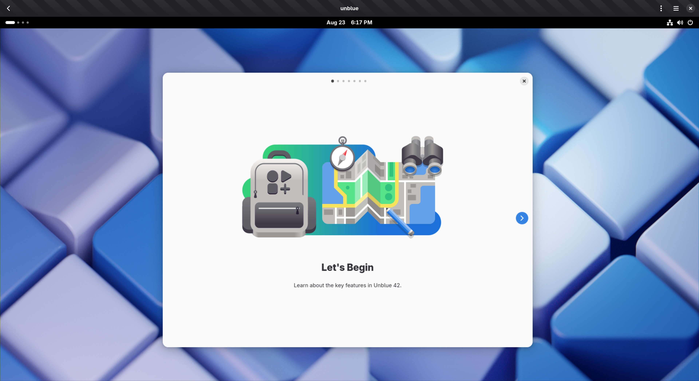

# Unblue

Silverblue without the blue.

# What is this

Unblue aims provide the Fedora Community with a faithful representation of GNOME that stays as close to the original design as possible vision as possible. It removes tweaks, modifications, overrides and extensions that Fedora adds. Additionally the only provides source for Applications is [Flathub](https://flathub.org/).



Download and ISO here.

Or Rebase from an existing Silverblue installation!

```
bootc switch ghcr.io/alatiera/unblue:latest
```

# How it works

Unblue is an automated rebuild of Silverblue, so you will always have the latest and greatest it has to offer, while also enjoying the spoils of Flathub and receive the latest Application Updates directly from their Developers.

Updates are automated and distributed in the same cadence as Silverblue, so you will not be afraid of the scary monster of Security.

## Future of unbule

While unblue is built on top of Fedora and Fedora's technologies, it will never have a role in realizing the complete empowerment of developers. It may temporarily show us however how thing could be and it can open the door and give us a preview on what a the future could look like, if we are to take the next step. See you one day on GNOME OS.
